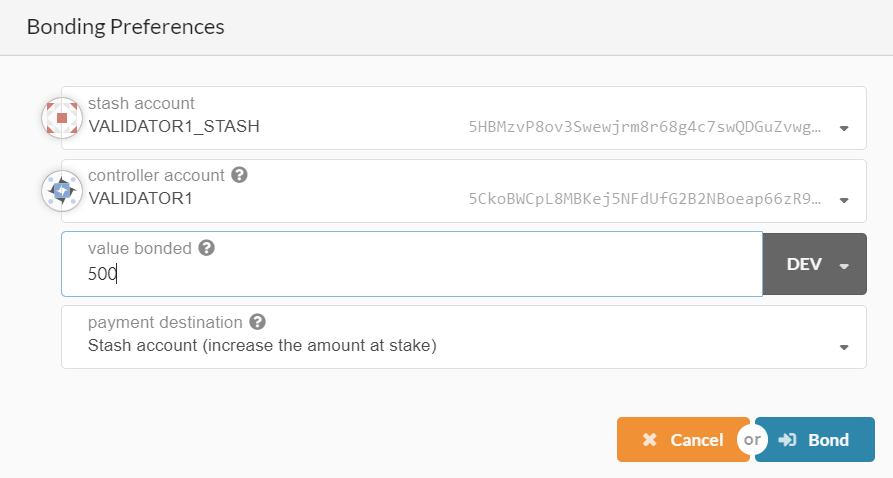
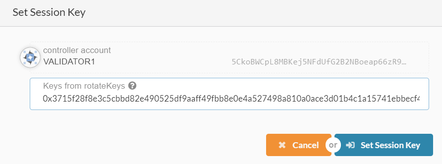
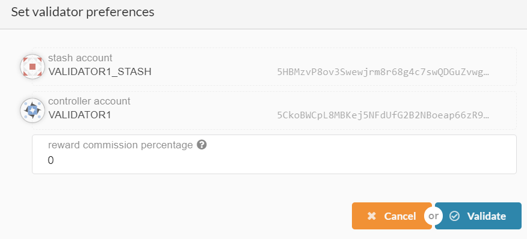

# Crust client
On one hand, this project is used to install all crust related programs, including chain, TEE, API, IPFS, etc. On the other hand, it provides the corresponding command line to assist the startup of the crust programs.

## Preparation work
- Hardware requirements: 

  CPU must contain SGX module, and make sure the SGX function is turned on in the bios
- Operating system requirements:

  Unbantu 16.04

## Install crust-client
Step 0. Install curl, nodejs and yarn
```shell
sudo apt install curl
curl -sL https://deb.nodesource.com/setup_10.x | sudo -E bash -
sudo apt install nodejs
sudo apt install yarn
```

### Git mode
Step 1. Download crust-client
```shell
git clone https://github.com/crustio/crust-client.git
```
Step 2. Into directory
```shell
cd crust-client
```
Step 3. Preparing the installation packages
```shell
mkdir resource # create resource directory
```
Then you need move installation packages into this directory ( resource ), include 'crust-api.tar' 'crust.tar'  'crust-tee.tar' ( for now, you can get those packages from crust organization and rename them ).

Step 4. Run install stcript
```shell
sudo ./install
```

### Package mode
Step 1. Download source code in release

[release page](https://github.com/crustio/crust-client/releases)

Step 2. Unzip crust-client-0.1.0-alpha.tar.gz
```shell
tar -zxf crust-client-0.1.0-alpha.tar.gz
```

Step 3. Into directory
```shell
cd crust-client-0.1.0-alpha
```

Step 4. Preparing the installation packages
```shell
mkdir resource # create resource directory
```
Then you need move installation packages into this directory ( resource ), include 'crust-api.tar' 'crust.tar'  'crust-tee.tar' ( for now, you can get those packages from crust organization and rename them ).

Step 5. Run install stcript
```shell
sudo ./install
```

## Configurations

### chain-launch.config
```shell
base_path=crust_store/node1/chain            # the base path of chain
port=30333                                   # the port for p2p
ws_port=9944                                 # the port for ws
rpc_port=9933                                # the port for rpc
name=node1                                   # the name of chain
node_key=                                    # only the genesis node need this:0000000000000000000000000000000000000000000000000000000000000001
bootnodes=(address1 address2 ...)            # the bootnodes for connect to the exist chain (if you are first node, you don't need this)
external_rpc_ws=false                        # Whether to publicize the ws and rpc interface (if you are genesis node or validator node, this configuration must be false)
```

### chain-identity-file

Only genesis node need this file, please connect to crust organization to get it.

### ipfs-launch.config

```shell
base_path=crust_store/node1/ipfs            # the base path for storing data
swarm_port=4001                             # the swarm port for other ipfs node connection
api_port=5001                               # the api port
gateway_port=8080                           # the gateway port
master_address=                             # if you are frist ipfs node, you don't need this
```

### api-launch.config
```shell
crust_api_port=56666                         # the api port
crust_chain_endpoint="ws://127.0.0.1:9944/"  # the ws address of chain
```

### tee-launch.json
{
    "base_path" : "/home/user/crust-alphanet/crust_store/node1/tee/",                    # All files will be stored in this directory, must be absolute path
    "empty_capacity" : 4,                                      # empty disk storage in Gb
    
    "ipfs_api_base_url" : "http://127.0.0.1:5001/api/v0",      # for connect to ipfs
    "api_base_url": "http://127.0.0.1:12222/api/v0",           # your tee node api address
    "validator_api_base_url": "http://127.0.0.1:12222/api/v0", # the tee validator address (**if you are genesis node, this url must equal to 'api_base_url'**)

    "crust_api_base_url" : "http://127.0.0.1:56666/api/v1",    #the address of crust api
    "crust_address" : "",                                      # your crust chain identity
    "crust_account_id" : "",
    "crust_password" : "",
    "crust_backup" : "",
    ......
}
```

## Run

### Run genesis node
The genesis node refers to the initial nodes of the chain written in the genesis spec. These nodes have a very important meaning as the core of the chain startup. They are also the initial validators. Generally genesis node's identity file is issued by crust organization.

#### Run IPFS
- Launch
```shell
   crust-client ipfs-launch genesis1_config/ipfs-launch.json -b logs/ipfs.log
```
- Monitor
```shell
   tail -f logs/ipfs.log.pid
```

#### TEE
- Launch
```shell
   crust-client tee-launch genesis1_config/tee-launch.json -b logs/genesis1-tee.log
```
- Monitor
```shell
   tail -f logs/genesis1-api.log.pid
```

- Wait for plotting disk

   Please use monitor to see infomation: "Waitting for chain to run..." before you launch chain.


#### Chain
- Launch
```shell
   crust-client chain-launch-genesis genesis1_config/chain-launch.config genesis1_config/chain-identity-file -b logs/genesis1-chain.log
```
- Monitor
```shell
   tail -f logs/genesis1-chain.log.pid
```

#### API
- Launch
```shell
   crust-client api-launch genesis1_config/api-launch.config -b logs/genesis1-api.log
```
- Monitor
```shell
   tail -f logs/genesis1-api.log.pid
```

- Test
```shell
   curl --location --request GET 'http://localhost:56667/api/v1/block/header'
```

### Run normal node
Normal node cannot be a validator, it is only an access node of the chain, and it can be connected to the chain browser by setting external_rpc_ws=true

#### Chain
- Launch
```shell
   crust-client chain-launch-normal normal1_config/chain-lanuch.config -b logs/normal1-chain.log
```
- Monitor
```shell
   tail -f logs/normal1-chain.log.pid
```

#### Chain browser
Connet to normal node ws like: ws://139.196.122.228:6013/ to see crust chian status.

### Run validator node
If you are not genesis node but want to apply to become a validator, please follow the instructions below. Of course you need a tee to report your workload

#### Run IPFS
- Launch
```shell
   crust-client ipfs-launch validator1_config/ipfs-launch.json -b logs/ipfs.log
```
- Monitor
```shell
   tail -f logs/ipfs.log.pid
```

#### TEE

- Configuration
  
  Please select tee of a validator node on chain to validate your tee by fill 'validator_api_base_url' and use valdator account (not stash account ) to configure crust chain identity.

- Launch
```shell
   crust-client tee-launch validator1_config/tee-launch.json -b logs/validator1-tee.log
```

- Monitor
```shell
   tail -f logs/validator1-api.log.pid
```

- Wait for plotting disk

   Please use monitor to see infomation: "Waitting for chain to run..." before you launch chain.

#### Chain
- Launch
```shell
   crust-client chain-launch-validator validator1_config/chain-launch.config -b logs/validator1-chain.log
```
- Monitor
```shell
   tail -f logs/validator1-chain.log.pid
```
- Get session keys
you will see a warning like:
```shell
   2020/02/21 14:51:30.023 [WARN] Please go to chain web page to bond your account with the session keys: "0x3715f28f8e3c5cbbd82e490525df9aaff49fbb8e0e4a527498a810a0ace3d01b4c1a15741ebbecf4d402c88ac87fdbaf92f013191cc8720adfa21275dad71f08763a5996258e336f995ff72b94e2cee776de5fbfbae365e344ef6ce347d767284619c7ba6078d7e59ab555399ad81a9b2cc89b0d43b8bc40f6df047d21014215"
```

#### Bond your account with the session keys

- Need two accounts and have some CRUs in those accounts, like:


- Go to **Staking/Account actions/New stake** to Bond two accounts, like:


- Click **session key** to set session key, like:


#### API
- Launch
```shell
   crust-client api-launch validator1_config/api-launch.config -b logs/validator1-api.log
```
- Monitor
```shell
   tail -f logs/validator1-api.log.pid
```

- Test
```shell
   curl --location --request GET 'http://localhost:56669/api/v1/block/header'
```

#### Start validate

- Waiting TEE
  
  Need to make sure your tee has plotted your empty disk and reported your first work report.

- Waiting one era

- Click "Validate" button, like:


- Waiting one era, you will see magic!

## License

[GPL v3](LICENSE)
